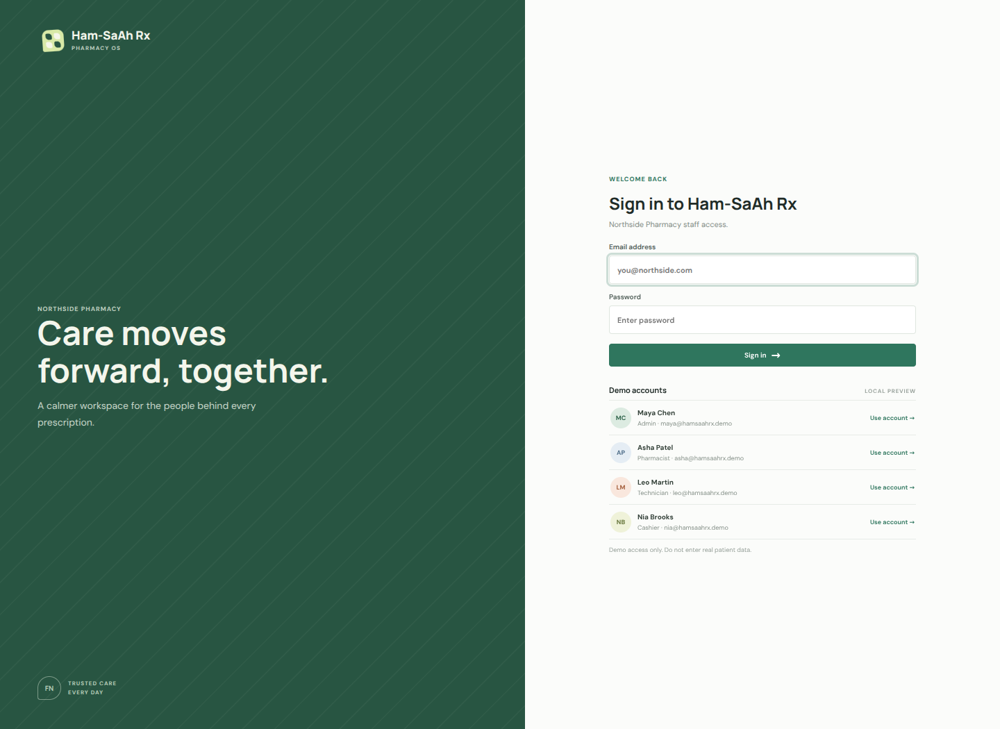
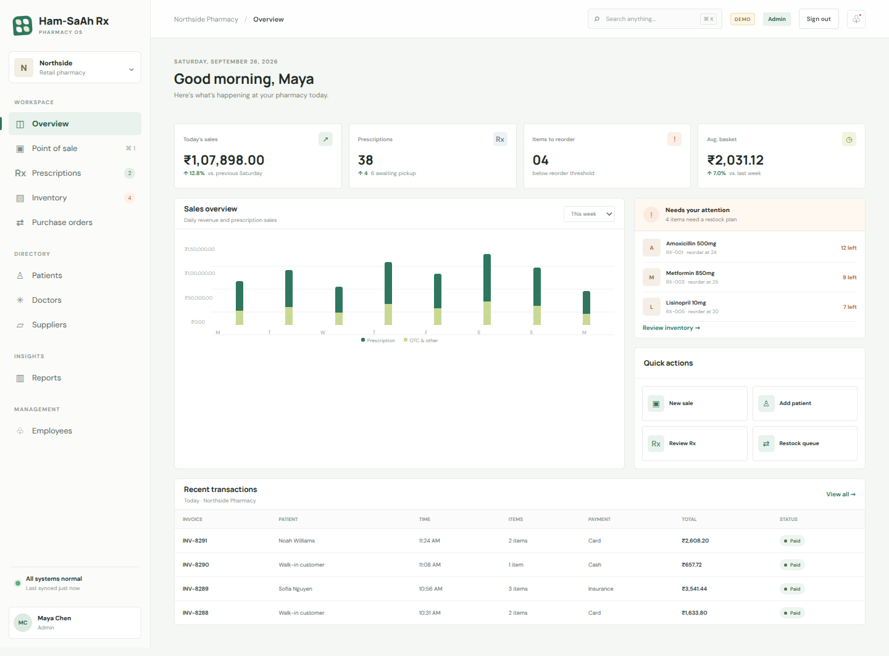
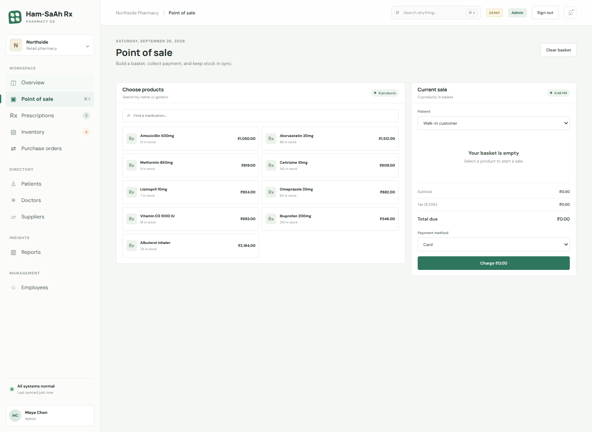
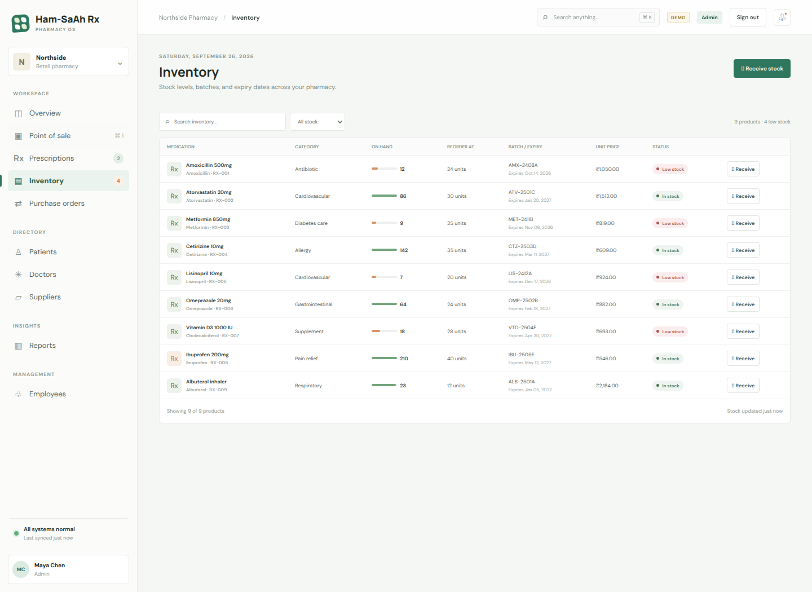
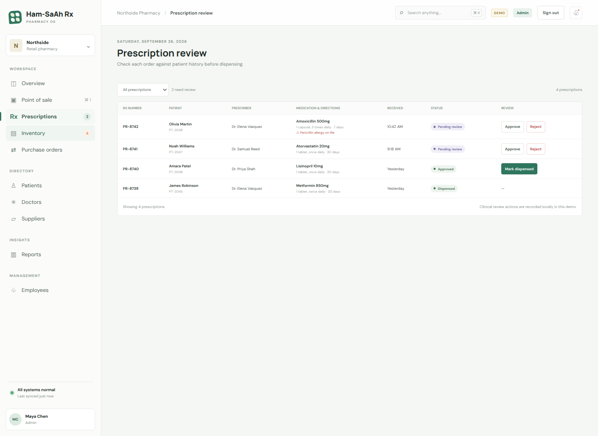
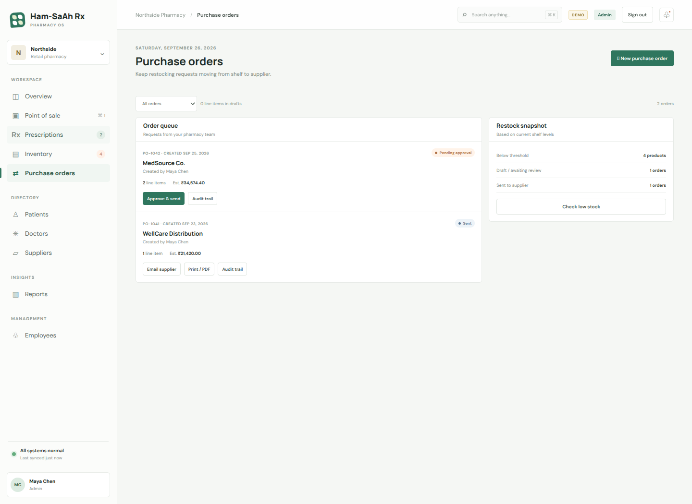

# Ham-SaAh Rx

A responsive, dependency-free pharmacy operations demo. Open `index.html` in a browser to sign in to the role-aware workspace. All displayed prices use INR.

## Page previews

| Sign in | Overview |
| --- | --- |
|  |  |

| Point of sale | Inventory |
| --- | --- |
|  |  |

| Prescription review | Purchase orders |
| --- | --- |
|  |  |

## Demo workflows

- Sign in as one of the four demo employees below to preview role-specific navigation and actions.
- Build and charge a cashier sale; stock is decremented and the invoice appears in recent transactions.
- Receive stock, filter inventory, review prescriptions, and create purchase-order drafts.
- As Admin, manage suppliers and employee accounts, approve and dispatch purchase orders, inspect the audit trail, print an order, or open an email draft.
- Add patients and doctors, inspect patient prescription history, and review role-scoped reports.

## Demo accounts

| Role | Email | Password |
| --- | --- | --- |
| Admin | `maya@hamsaahrx.demo` | `maya123` |
| Pharmacist | `asha@hamsaahrx.demo` | `asha123` |
| Technician | `leo@hamsaahrx.demo` | `leo123` |
| Cashier | `nia@hamsaahrx.demo` | `nia123` |

Demo changes are stored in this browser's local storage. Use the browser console to clear the demo data with `localStorage.removeItem('hamsaahrx-pharmacy-demo-v1')` and reload. Existing Fieldnote demo data is migrated automatically.

This is a frontend prototype, not a production pharmacy system. Login credentials and employee records live in browser storage; there is no server-side authentication or authorization, shared database, payment gateway, or clinical decision support. Print uses the browser's print dialog and supplier email opens the configured mail app. Do not use real patient data.
